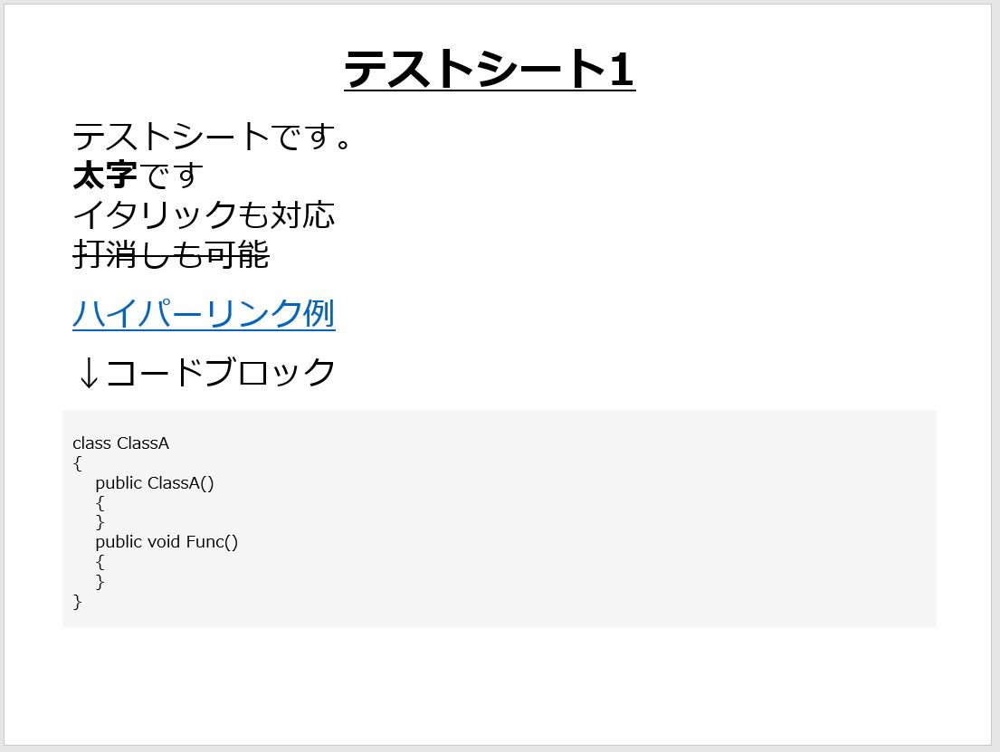
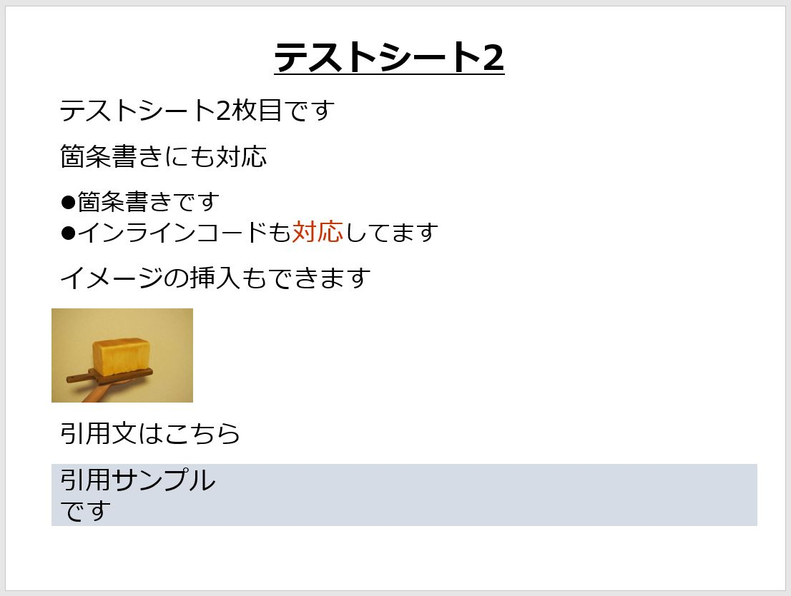
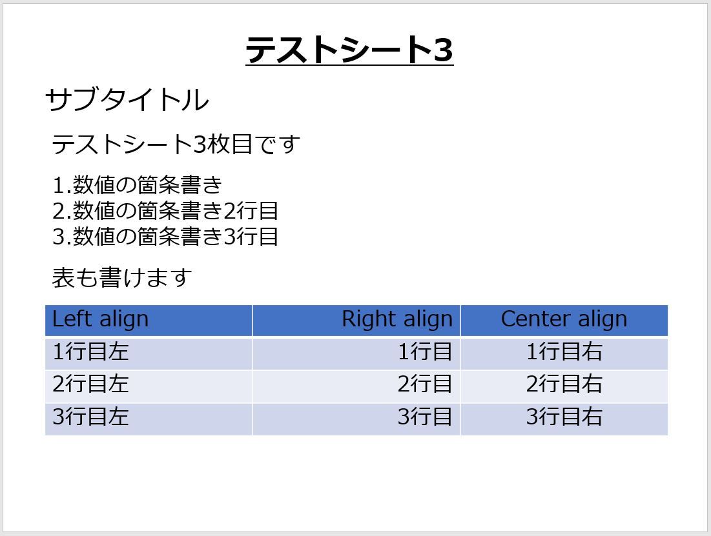

# MDToPPTX
マークダウン形式のファイルを読み込んでPowerPoint形式(pptx)のファイルを出力するライブラリ  
.Net Standard 2.0対応

マークダウンの解析には[markdig](https://github.com/lunet-io/markdig)を利用しています

# 対応構文
+ HEADERS(Level1 or Level2に対応)
+ BLOCKQUOTES
+ LISTS
+ CODE BLOCKS
+ LINKS
+ EMPHASIS
+ Images(1pixel -> 1mmで配置)
+ Table

## MarkPP.exe
MDToPPTXをWindowsで使用するための実行ファイル

## MarkPP.exeの使い方

以下のコマンドを実行する

```
MarkPP.exe "markdownfle path" "title" "subtitle"
```

## input Markdown例

```
# テストシート1

テストシートです。  
**太字**です  
*イタリック*も対応  
~~打消しも可能~~

[ハイパーリンク例](http://ayumax.hatenablog.com/)

↓コードブロック

```　　　

class ClassA  
{  
    public ClassA()  
    { 

    }

    public void Func()
    {

    }
}  

```　　　


---

# テストシート2

テストシート2枚目です

箇条書きにも対応

+ 箇条書きです
+ インラインコードも`対応`してます

イメージの挿入もできます


引用文はこちら
> 引用サンプル
> です

---
# テストシート3
## サブタイトル

テストシート3枚目です

1. 数値の箇条書き
1. 数値の箇条書き2行目
1. 数値の箇条書き3行目

表も書けます

| Left align | Right align | Center align |
|:-----------|------------:|:------------:|
| 1行目左    | 1行目        | 1行目右      |
| 2行目左    | 2行目        | 2行目右      |
| 3行目左    | 3行目        | 3行目右      |    

```

## output PPTX



